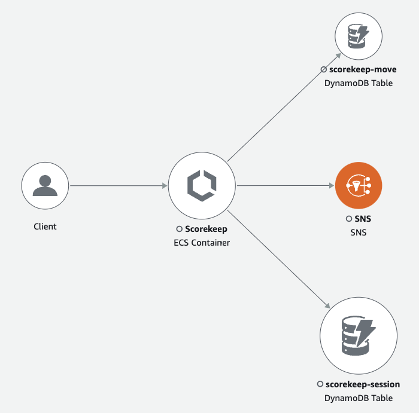
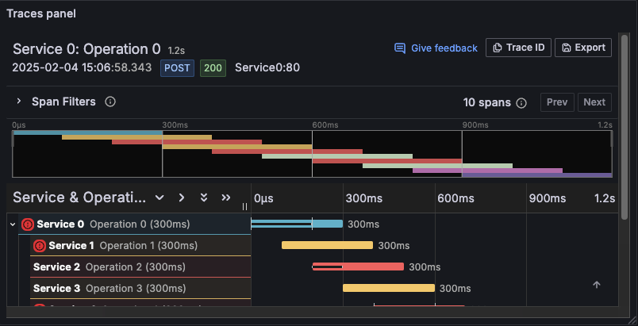

# Monitoring & Observability

**Monitoring & Observability**: How do we understand what's happening inside our complex, distributed systems?

### What is Monitoring & Observability?

**Monitoring** is the practice of collecting, aggregating, and analyzing metrics and logs to understand system behavior and detect issues. It typically focuses on known failure modes and predefined alerts.

**Observability** goes deeper - it's the ability to measure a system's current internal state by examining its external outputs. In a cloud environment, where you don't own the hardware, this is essential. It's about asking arbitrary questions about your system in real-time to understand its behavior without having to ship new code to answer them.

Monitoring tells you that something is wrong (e.g., "The EC2 instance CPU is at 100%!").

**Observability** helps you understand why it's wrong and enables you to explore unknown unknowns (e.g., "The CPU is high because a Lambda function is putting thousands of messages into an SQS queue, and the EC2 worker processing them has a memory leak caused by a specific combination of input data we hadn't anticipated.").

Observability is typically built on three core data types, often called the "Three Pillars of Observability," along with modern practices like Service Level Objectives (SLOs) and error budgets.

### The Three Pillars of Observability

#### a) Metrics
Metrics are numerical representations of data measured over time.

**Analogy**: Your AWS billing dashboard. It gives you a high-level view of your spending over time.

**Examples**: EC2 CPUUtilization, ELB RequestCount, Lambda Invocations, RDS DatabaseConnections.

#### b) Logs
Logs are immutable, timestamped records of discrete events that happened over time.

**Analogy**: AWS CloudTrail logs. They provide a detailed, chronological record of every API call made in your AWS account.

**Examples**: An application log from a container in ECS, a VPC Flow Log showing network traffic, or a Lambda function's output.

#### c) Traces (Distributed Tracing)
A trace tracks the journey of a single request as it moves through a distributed system. This is crucial in microservice architectures built on services like API Gateway, Lambda, ECS, and SQS.

**Analogy**: AWS X-Ray. It visualizes the path of a request through various AWS services, showing latencies and errors.

**Analogy**: A waterfall view in a tracing tool like Grafana Tempo, showing the breakdown of time spent in each service.

### Common Tools and Services

To implement observability, engineers use a combination of open-source tools, third-party services, and cloud-native solutions.

| Pillar | General / Open-Source Tools | AWS Services |
|--------|----------------------------|--------------|
| **Metrics** | **Prometheus**: A powerful time-series database and monitoring system. **Grafana**: The de-facto open-source tool for visualizing metrics from many sources. **Datadog, New Relic, Dynatrace, Honeycomb**: Commercial all-in-one observability platforms. | **Amazon CloudWatch Metrics**: The native AWS service. It automatically collects metrics from most AWS services. You can also publish custom application metrics to it. |
| **Logs** | **Elastic Stack (ELK)**: Elasticsearch, Logstash, and Kibana for log aggregation, processing, and searching. **Grafana Loki**: A log aggregation system designed to be cost-effective and easy to operate. **Splunk, Dynatrace, Honeycomb**: Popular commercial platforms for searching and analyzing machine-generated data. | **Amazon CloudWatch Logs**: Centralized logging for applications running on EC2, ECS, Lambda, and more. Use CloudWatch Logs Insights to run powerful queries against your logs. |
| **Traces** | **Jaeger, Zipkin**: Open-source distributed tracing systems. **OpenTelemetry**: A vendor-neutral standard (a set of APIs and SDKs) for generating telemetry data. It is the future of instrumentation and provides unified collection across metrics, logs, and traces. **Datadog APM, New Relic APM, Dynatrace, Honeycomb**: Commercial Application Performance Monitoring tools. | **AWS X-Ray**: A distributed tracing service that helps you analyze and debug production, distributed applications, such as those built using a microservices architecture. It integrates with ELB, API Gateway, Lambda, EC2, etc. **AWS Distro for OpenTelemetry**: A secure, production-ready distribution of the OpenTelemetry project. |
